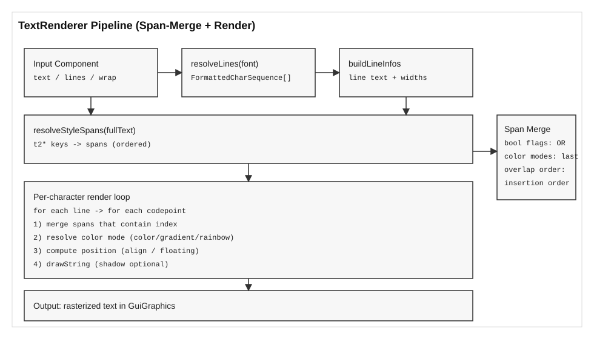

# Fizzy

Fizzy is a Minecraft mod that provides a lightweight UI framework for building custom screens and menu UIs with pads, elements, frames, backgrounds, and splits.

## Usage Guide

### 1) Build a GUI with `FizzyGuiBuilder`

The builder is the main entry point. You configure size, frame, background, elements, and optional splits.

```java
var frame = new FizzyFrame(Component.literal("Example"));

FizzyGui gui = FizzyGuiBuilder.start()
        .sizeSlots(9, 3) // cols, rows (default is 9x3 if omitted)
        .frame(frame)
        .background(new FizzyBg(BgType.STONE))
        .behind(new BlurBehind())
        .padByFrame()
        .element(new FizzyBackgroundElement(BgType.BARRIER)).done()
        .pad(1, 1, 1, 3)
        .element(ColoredButtonElement.builder(Component.literal("Button"), btn -> {
            // click handler
        }).build()).done()
        .build();
```

Notes:
- `frame(...)` is required.
- `background(...)` defaults to `FizzyBg(BgType.STONE)` if omitted.
- `behind(...)` defaults to `BlurBehind()` if omitted.
- Slots are 18px (`UiUnit.SLOT_PX`).

### 2) Host the GUI

For normal screens:
```java
Minecraft.getInstance().setScreen(new FizzyScreenHost(gui));
```

For container-based menus:
```java
var screen = new FizzyMenuScreenHost<>(menu, playerInv, Component.literal("Title"), gui);
Minecraft.getInstance().setScreen(screen);
```

### 3) Pads and Element Placement

Pads define regions, elements are placed inside pads in the order they are added.

```java
// Slot-based pad (row/col, 1-based)
builder.pad(2, 5, 3, 8)
       .element(new SlotElement())
       .done();

// Pixel-based pad
builder.padByPx(10, 20, 64, 32)
       .element(new IconElement(ResourceLocation.withDefaultNamespace("textures/item/apple.png")))
       .done();

// Frame-based pad (full frame)
builder.padByFrame()
       .element(new FizzyBackgroundElement(BgType.BARRIER))
       .done();
```

### 4) Built-in Elements

Common elements:
- Buttons: `FizzyButtonElement`, `ColoredButtonElement`, `WidgetButtonElement`, `IconButtonElement`
- Slots: `SlotElement`
- Icons: `IconElement`
- Background element: `FizzyBackgroundElement`
- Below buttons: `LeftButtonBelow`, `CenterButtonBelow`, `RightButtonBelow`, `DoubleButtonBelow`

Example: icon button
```java
var appleButton = IconButtonElement.builder(
        Component.empty(),
        btn -> player.sendSystemMessage(Component.literal("Apple clicked!")),
        ResourceLocation.withDefaultNamespace("textures/item/apple.png")
).build();
```

### 5) Splits

Splits draw simple separators on the slot grid.

```java
builder.splitByPx(UiUnit.SLOT_PX * 3 - 1, 0, UiUnit.SLOT_PX * 4, SplitType.VERTICAL);
```

### 6) Finding Elements at Runtime

Both hosts provide runtime queries:
```java
List<ElementPainter> elements = screen.elementsAtSlot(2, 5); // slot row/col
List<ElementPainter> elementsPx = screen.elementsAtPx(mouseX, mouseY); // pixel
```

You can use `ElementType` to filter categories and `widgets()` to access real widgets.

```java
for (ElementPainter element : screen.elementsAtSlot(2, 5)) {
    if (element.type() == ElementType.BUTTON) {
        for (AbstractWidget widget : element.widgets()) {
            widget.active = false;
        }
    }
}
```

## Development Guide

### Creating Custom Elements

Implement `ElementPainter`:

```java
public final class MyElement implements ElementPainter {
    @Override
    public void init(InitContext context, int leftPx, int topPx, int widthPx, int heightPx) {
        // Optional: add widgets using context.addRenderableWidget(...)
    }

    @Override
    public void render(GuiGraphics g, int leftPx, int topPx, int widthPx, int heightPx, float partialTick) {
        // Draw your element
    }

    @Override
    public ElementType type() {
        return ElementType.CUSTOM;
    }
}
```

If your element represents a button and you want it to be discoverable by other systems:
1. Return `ElementType.BUTTON`
2. Override `widgets()` to return all interactive widgets.

```java
@Override
public ElementType type() { return ElementType.BUTTON; }

@Override
public List<AbstractWidget> widgets() { return List.of(myButtonWidget); }
```

### Using the Built-in Builder in Custom Screens

The builder is chainable and pads are stacked in order of definition (last pad = top layer).
If you need an overlay (for example, a blocker), add it after the content it should cover.

### Build and Run (NeoForge)

Requires Java 21.

```bash
./gradlew runClient
```

## TextRenderer Pipeline (Research Note)

This section documents the TextRenderer rendering pipeline with a reproducible, implementation-faithful view of span resolution and style composition. The goal is to clarify how `t2*` spans are matched, merged, and finally rasterized. See the schematic below.



### 1) Canonical Text Stream
The renderer first produces a line list (`resolveLines`), then converts each line into a plain string to compute widths and a single `fullText` string. For multiline text, `fullText` is the concatenation of line strings separated by `\n`. This `fullText` is the **index domain** for all `t2*` span matches.

### 2) Span Construction and Ordering
`t2*` inputs are converted into `StyleSpan` entries. The insertion order is deterministic:
- Explicit spans (`styleRange`, `styleIndex`) are stored first.
- `t2*` map entries are inserted next in the order provided by the map (the builder copies into a `LinkedHashMap` to preserve insertion order).
- Substring keys produce multiple spans in scan order from left to right.

This ordered list is **not merged** upfront; it is evaluated per character at render time.

### 3) Per-Character Merge Semantics
For each codepoint index in `fullText`, all spans that contain that index are visited in list order. The merge rules are:
- Boolean flags (bold, underline, strikethrough, floating, pixelated) **accumulate**. Later spans can override only when they explicitly set that flag.
- Color modes (direct color, gradient, rainbow, rainbow-gradient) are **mutually exclusive**. The last matching span that sets a color mode wins for that character.
- When no span matches, base styles from the builder are used.

### 4) Rendering
Each character is positioned (align + optional floating offset) and rendered via `GuiGraphics.drawString`, with optional shadow. Underline and strikethrough are drawn as post-pass fills using the resolved color for that character.

This model ensures `t2*` spans are strictly local to their match ranges and composable in a predictable, paper-traceable manner.

## TODO
- Additional elements (Text, Image, TextField, Slider, Checkbox, RadioButton, Dropdown)
- Improve menu render order if needed
